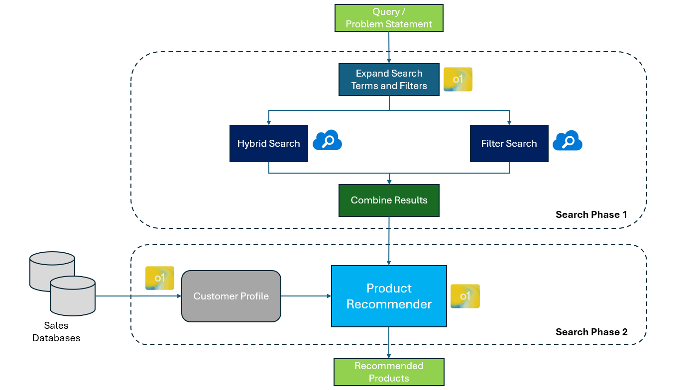

# Retail Search with AI
Enhanced search for Retail and e-Commerce using various AI models

## Business Value of AI-Enhanced Search

Traditional keyword-based search systems often fail to understand customer intent, context, and preferences, leading to irrelevant results and lost sales opportunities. This project implements a sophisticated two-stage AI-powered retail search system that significantly improves search relevancy and conversion rates:

### Stage 1: Query Discovery & Expansion
The system analyzes the user's query and customer profile to:
- Expand search terms based on customer intent
- Identify relevant product categories
- Apply appropriate filters (price range, brand preferences, etc.)
- Consider customer purchase history and preferences

### Stage 2: Intelligent Product Recommendation
After retrieving initial results, the AI system:
- Re-ranks products based on customer profile
- Considers purchase history and preferences
- Provides personalized product recommendations
- Adds contextual justification for recommendations

### Business Impact

**Increased Conversion Rates:** Studies show that relevant search results can increase conversion by 50-80%. This system ensures customers find what they're actually looking for, not just what matches keywords.

**Higher Average Order Value:** Personalized recommendations drive cross-selling and upselling opportunities, increasing basket size.

**Reduced Search Abandonment:** By understanding customer intent, even vague queries yield relevant results, reducing search abandonment rates.

**Enhanced Customer Loyalty:** Personalized search experiences increase customer satisfaction and loyalty, driving repeat purchases.

**Competitive Advantage:** Advanced AI search capabilities provide a significant edge over competitors using traditional keyword search.

**ROI Measurement:** The evaluation framework allows organizations to measure and optimize the performance of different AI models against business KPIs.

## Setup Instructions

1. Fill in the `.env` file with the necessary environment variables:

```
SEARCH_SERVICE_NAME=<your_search_service_name>
SEARCH_INDEX_NAME=<your_search_index_name>
SEARCH_API_KEY=<your_search_api_key>
```

2. Install and run the server:

```bash
# create the conda environment
conda create -n ecomm python=3.11

# activate the conda environment
conda activate ecomm

# install the requirements
pip install -r requirements.txt

# run the server
python server.py
```

3. Browse to `localhost:80`.

## Project Structure

- `env_vars.py`: Environment variables configuration
- `evals.py`: Evaluation logic for comparing AI models
- `server.py`: FastAPI server setup and endpoints
- `search/`: Contains search-related logic and configurations
  - `azure_search.py`: Azure AI Search integration
  - `config.py`: Configuration for Azure Search and prompt files
  - `retail_search_ai.py`: AI-based search and recommendation logic
  - `search_data_models.py`: Data models for search requests and responses
  - `search_processing.py`: Search processing logic
- `utils/`: Utility functions and helpers
- `customer_profiles/`: Sample customer profiles in JSON format
- `evaluations/`: Directory for storing evaluation results
- `images/`: Directory for storing images
- `prompts/`: Directory for storing prompt templates
- `ui/`: Directory for React UI app

## AI Search Architecture



## Model Comparison and Evaluation

This project includes a robust framework for comparing different AI models (Azure OpenAI) with varying reasoning efforts (low, medium, high). The evaluation system:

1. Generates realistic customer queries based on profiles
2. Processes those queries through different AI models
3. Compares search results using objective metrics
4. Produces JSONL reports to quantify performance differences

This allows organizations to select the optimal model for their specific use case, balancing performance with cost considerations.

## API Endpoints

### List Customers

```
GET /api/customers
```

Returns a list of customer profile filenames.

### Get Customer Profile

```
GET /api/customer/{filename}
```

Returns the customer profile data for the specified filename.

### Retail Search

```
POST /api/retail_search
```

Accepts search parameters and returns search results.

### Search Endpoint

```
POST /api/search
```

Accepts search parameters and returns search results from both sides (comparison).

## Evaluation

The `evaluate` function in `evals.py` is used to evaluate the performance of different AI models based on customer queries and profiles. The results are stored in JSONL format in the `evaluations` directory.

## Query Generation

The `generate_queries` function in `evals.py` is used to generate customer queries based on profiles and product categories. The generated queries are stored in JSONL format in the `evaluations` directory.